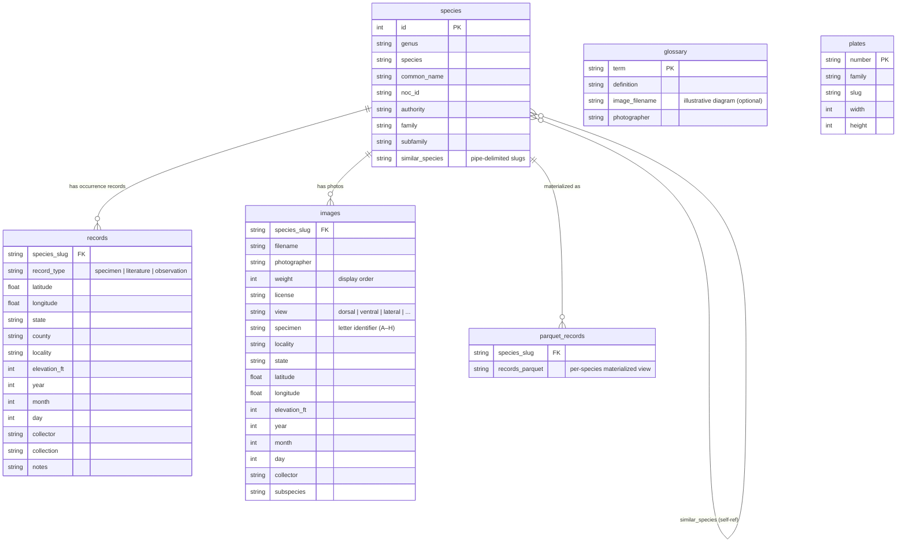

# Data

Source files for the pnwmoths static build pipeline. CSV and JSON files are the authoritative source; Parquet files are derived at build time.

## Entity Relationship Diagram

## Files

| File | Rows (approx) | Description |
|------|--------------|-------------|
| `species.csv` | ~900 | One row per species. Primary key is `id`; slug is derived as `genus.lower()-species.lower()`. |
| `records.csv` | ~30 000 | Geo-referenced occurrence records (specimens, literature, observations). |
| `records-bad.csv` | varies | Records that failed validation — same schema as `records.csv`. |
| `images.csv` | ~5 000 | Photo metadata. Images are hosted on the CDN; `filename` is the CDN asset key. |
| `glossary.csv` | ~150 | Wing-anatomy and taxonomy terms injected into species fact sheets at build time. |
| `plates.json` | ~50 | Reference plate metadata (legacy moth-guide plates). Width/height used for CDN image sizing. |
| `parquet/<slug>/records.parquet` | varies | Per-species records, materialized by `scripts/build-data.js` for fast DuckDB queries at build time. |

## Slug convention

Species slugs are derived as `genus.toLowerCase() + '-' + species.toLowerCase()` (e.g., `apantesis-arizoniensis`). Slugs are used as foreign keys in `records.csv`, `images.csv`, and `parquet/` directory names. They are not stored in `species.csv` — derive them at read time.
