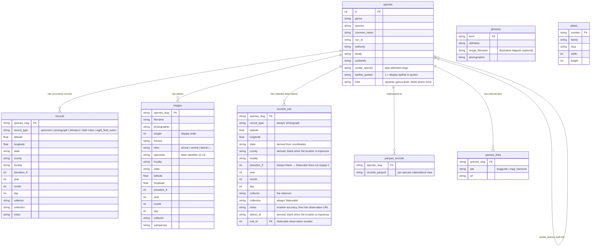

# Data

Source files for the pnwmoths static build pipeline. CSV and JSON files are the authoritative source; Parquet files are derived at build time.

Several files here are **advisory reports** rather than inputs — generated output that states a
disagreement or a gap for a human to judge, which nothing in the build reads back. They are all
published on the built site at **`/curation/`**, an unlinked index that says what question each
one answers and when it was regenerated. That page is the list; the table below is the schema.
See [ADR 0037](../docs/adr/0037-curation-reports-published-unlinked.md), and add new reports to
[`src/_data/curationReports.ts`](../src/_data/curationReports.ts).

## Entity Relationship Diagram


```mermaid
erDiagram
    species {
        int     id            PK
        string  genus
        string  species
        string  common_name
        string  noc_id
        string  authority
        string  family
        string  subfamily
        string  similar_species   "pipe-delimited slugs"
        string  epithet_quoted    "1 = display epithet in quotes"
        string  tribe             "optional; genus-level, blank where none"
    }

    records {
        string  species_slug   FK
        string  record_type    "specimen | photograph | literature | field notes | sight_field_notes"
        float   latitude
        float   longitude
        string  state
        string  county
        string  locality
        int     elevation_ft
        int     year
        int     month
        int     day
        string  collector
        string  collection
        string  notes
    }

    images {
        string  species_slug   FK
        string  filename
        string  photographer
        int     weight         "display order"
        string  license
        string  view           "dorsal | ventral | lateral | ..."
        string  specimen       "letter identifier (A–H)"
        string  locality
        string  state
        float   latitude
        float   longitude
        int     elevation_ft
        int     year
        int     month
        int     day
        string  collector
        string  subspecies
    }

    glossary {
        string  term           PK
        string  definition
        string  image_filename "illustrative diagram (optional)"
        string  photographer
    }

    plates {
        string  number         PK
        string  family
        string  slug
        int     width
        int     height
    }

    records_inat {
        string  species_slug   FK
        string  record_type    "always 'photograph'"
        float   latitude
        float   longitude
        string  state          "derived from coordinates"
        string  county         "derived; blank when the location is imprecise"
        string  locality
        int     elevation_ft   "always blank — iNaturalist does not supply it"
        int     year
        int     month
        int     day
        string  collector      "the observer"
        string  collection     "always 'iNaturalist'"
        string  notes          "location accuracy, then the observation URL"
        string  district_id    "derived; blank when the location is imprecise"
        int     inat_id        PK "iNaturalist observation number"
    }

    parquet_records {
        string  species_slug   FK
        string  records_parquet "per-species materialized view"
    }

    species_links {
        string  species_slug   FK
        string  site           "bugguide | mpg | bamona"
        string  url
    }

    species ||--o{ records          : "has occurrence records"
    species ||--o{ records_inat     : "has imported observations"
    species ||--o{ images           : "has photos"
    species ||--o{ parquet_records  : "materialized as"
    species ||--o{ species_links    : "has external links"
    species }o--o{ species          : "similar_species (self-ref)"
```

## Files

| File | Rows (approx) | Description |
|------|--------------|-------------|
| `species.csv` | 1 424 | One row per species. Primary key is `id`; slug is derived as `genus.lower()-species.lower()` with whitespace collapsed to hyphens (see [Slug convention](#slug-convention)). `epithet_quoted` (`1` or blank) marks epithets the reference site shows in quotes (e.g. Clostera `"apicalis"`); it drives display only — the slug and foreign keys always use the clean epithet. See [`src/_lib/format-epithet.ts`](../src/_lib/format-epithet.ts). |
| `records.csv` | ~30 000 | Geo-referenced occurrence records (specimens, literature, observations). |
| `records-inat.csv` | ~60 | **Generated, not hand-edited.** Occurrence records imported from the [PNWMoths iNaturalist project](https://www.inaturalist.org/projects/pnwmoths) by [`scripts/sync-inat-records.ts`](../scripts/sync-inat-records.ts) (`npm run inat:sync`), rewritten in full every run. Same 15 columns as `records.csv` plus `inat_id`, the observation number that keys the reconcile. See [ADR 0026](../docs/adr/0026-inaturalist-project-sync.md) and [_instructions/SYNCING_INATURALIST.md](../_instructions/SYNCING_INATURALIST.md). |
| `inat-sync-report.csv` | varies | Generated. One row per observation the sync did *not* import, with the reason. Rewritten every run. |
| `records-bad.csv` | varies | Records that failed validation — same schema as `records.csv`. |
| `records-bad-coords.csv` | varies | Records dropped for coordinates outside the PNW bounds (lat 42–60, lon −139 to −110) — typically swapped lat/lon. Kept for curation; not built into the site. Produced by [`scripts/recover-clipped-bc-records.ts`](../scripts/recover-clipped-bc-records.ts). |
| `hidden-images-report.csv` | ~3 800 | **Generated, not hand-edited.** One row per catalogued photograph its **species account** does not display, with the reason (`cause`) and where it is still shown (`displayed_as` — blank means nowhere on the site at all). Written by [`scripts/emit-hidden-images.ts`](../scripts/emit-hidden-images.ts) (`npm run report:hidden-images`), which needs **no build**: `displayed_as` comes from the display index ([`src/_lib/photo-display-index.ts`](../src/_lib/photo-display-index.ts)), which inverts the selection rules over the artifacts the surfaces render from, and which [`scripts/check-display-index.ts`](../scripts/check-display-index.ts) checks against the emitted HTML on every build. It reads the emitted site no longer, but it is still held to it — the report used to scan `_site/` because browse, Identify and similar-species thumbnails all read `images.csv` directly and never consult tile status, and no module owned that ([ADR 0040](../docs/adr/0040-photo-display-module.md)). `determined_by` names the issue where the curator settled what the photograph is, so a filename that disagrees with its species reads as adjudicated rather than as an open question. Sorted worst-first by cause, and within a cause the photographs shown nowhere come first. Advisory: nothing reads it back and it can never fail a build. See [#299](https://github.com/pnwinsects/pnwmoths/issues/299). |
| `images.csv` | ~5 000 | Photo metadata. Images are hosted on the CDN; `filename` is the CDN asset key. |
| `photo-determinations.csv` | ~30 | **Curator-owned.** One row per photograph whose filename names a different species from the one it depicts — a rename, a merge, or a redetermination. Keyed by *photo stem* (the filename without its extension), which names the same photograph in both `images.csv` (`.jpg`) and the photo manifest (`.tif`). Carries the destination `specimen` letter too, because moving a photograph can collide with a letter the destination already uses and C-026 gives the incoming one the next free letter. Applied over the filename match by [`scripts/generate-species-photos.ts`](../scripts/generate-species-photos.ts) and enforced by [`scripts/check-photo-determinations.ts`](../scripts/check-photo-determinations.ts) on every build. Filenames are never rewritten — see [ADR 0038](../docs/adr/0038-photo-identity-is-data-not-filename.md). Deliberately small: every row is a curator's ruling, quoted, with the issue it was made on. |
| `image-derivatives.csv` | ~23 000 | Generated, not hand-edited. One row per pre-generated image variant *confirmed uploaded* to the CDN under `derived/` — written by [`scripts/upload-derivatives.ts`](../scripts/upload-derivatives.ts), checked by [`scripts/check-derivatives.ts`](../scripts/check-derivatives.ts) on every build. See [ADR 0022](../docs/adr/0022-pregenerated-image-derivatives.md) and [_instructions/GENERATING_DERIVATIVES.md](../_instructions/GENERATING_DERIVATIVES.md). |
| `cdn-inventory-report.csv` | ~900 | **Generated, not hand-edited.** One row per CDN finding: an object in the Bunny Storage Zone that nothing in this repo accounts for, or a path the repo says is on the CDN that is not there. Written by [`scripts/emit-cdn-inventory.ts`](../scripts/emit-cdn-inventory.ts) (`npm run cdn:inventory`), which needs the zone password and the network. Advisory: nothing in the build reads it and nothing deletes from the zone. See [ADR 0036](../docs/adr/0036-cdn-inventory-by-accountability.md) and [_instructions/AUDITING_THE_CDN.md](../_instructions/AUDITING_THE_CDN.md). |
| `cdn-duplicates-report.csv` | ~70 | **Generated, not hand-edited.** Byte-identical copies of the same image in the Storage Zone, where at least one copy is unaccounted for — the leftovers of genus renames, slug fixes and filename fixes, which are additive and never delete ([ADR 0008](../docs/adr/0008-deploy-bunny-additive.md)). Grouped by SHA256, which the storage listing reports for free. Written by [`scripts/emit-cdn-inventory.ts`](../scripts/emit-cdn-inventory.ts) alongside `cdn-inventory-report.csv`. See [ADR 0036](../docs/adr/0036-cdn-inventory-by-accountability.md). |
| `glossary.csv` | ~150 | Wing-anatomy and taxonomy terms injected into species fact sheets at build time. |
| `species-links.csv` | ~2 400 | Per-species external links (BugGuide, Moth Photographers Group, Butterflies and Moths of North America). Long format: one row per link (`species_slug,site,url`); a species may have several. Extracted from the legacy reference MySQL DB by [`scripts/extract-reference-links.ts`](../scripts/extract-reference-links.ts) (`npm run links:materialize`). |
| `plates.json` | ~50 | Reference plate metadata (legacy moth-guide plates). Width/height used for CDN image sizing. |
| `checklist-order.csv` | 1 424 | Generated. Every species in checklist (phylogenetic) order; **row order is the data**, one row per species in `species.csv`. Columns `species_slug,mpg_p_no,matched_via`. Written by [`scripts/build-checklist-order.ts`](../scripts/build-checklist-order.ts). See [Checklist order](#checklist-order) below and [ADR 0030](../docs/adr/0030-checklist-order-from-mpg.md). |
| `mpg-taxa.csv` | 13 245 | The Moths Photographers Group North American taxon list, the source of checklist order. All 17 columns of `MPG-Taxa_20240311.xlsx`, rendered once by [`scripts/convert-mpg-xlsx.ts`](../scripts/convert-mpg-xlsx.ts). Not hand-edited — replace it wholesale when MPG ships a new workbook. |
| `mpg-crosswalk.csv` | ~5 | **Curator-owned.** One row per species that no mechanical tier can match to an MPG row, mapping it to a binomial with the decision's `source` (issue comment, reasoning). Deliberately small: every row here is a judgement call someone made and can be held to. |
| `parquet/<slug>/records.parquet` | varies | Per-species records, materialized by `scripts/build-data.js` for fast DuckDB queries at build time. |

## Taxonomy provenance (`family` / `subfamily` / `tribe`)

There is **no structured taxonomy table** in the legacy reference site. `family`, `subfamily`, and `tribe` are reverse-engineered from the reference site's CMS browse-page URL hierarchy (`browse/family-…/subfamily-…/[tribe-…/]genus/species`), captured when `species.csv` was first migrated. `subfamily` and `tribe` are both **genus-level** properties — every species of a genus shares them — so they can be backfilled for a blank row by looking up any already-classified species of the same genus.

`tribe` is optional (blank where the subfamily has no tribal subdivision, or the genus post-dates the legacy hierarchy) and was materialized by [`scripts/backfill-tribe.ts`](../scripts/backfill-tribe.ts) from the reference DB's browse paths — additive-only and idempotent. See [ADR 0016](../docs/adr/0016-tribe-hierarchy-level.md) and [data-provenance](../docs/reference/data-provenance.md).

Two things trip up anyone re-deriving this data:

- **The browse URLs use several schemes.** Besides the canonical form above, some subfamily segments drop the `subfamily-` prefix, and the whole **Geometridae** subtree uses an older prefix-less layout (`browse/geometridae/subfamily/tribe/genus/…`). A parser that only handles the canonical form silently drops those species — this is why every Geometridae was unclassified until the backfill in [#74](https://github.com/pnwinsects/pnwmoths/pull/74). Parse the genus out of the path text; do **not** trust the DB's `factsheet_id` join for this (it is misaligned in the current snapshot).
- **Genus synonymy.** A few genera are listed under an older name (e.g. `Speranza` species appear under `Macaria`), so a genus-keyed lookup misses them.

A handful of species remain unclassified because they have no page on the reference site (or their `family` itself is suspect) — tracked in [#73](https://github.com/pnwinsects/pnwmoths/issues/73). Prefer the reference site over external sources like iNaturalist, whose subfamily circumscriptions sometimes disagree (e.g. iNat lumps `Acopa` into Noctuinae; the reference site places it in Amphipyrinae).

## Two record files, two owners

Occurrence records live in two files. `records.csv` is **curator-owned**: hand-edited, and
mutated only by deliberate, maintainer-run scripts. Those are additive with two deliberate
exceptions, both pure deletions a human asks for and reviews as a diff —
[`dedup-records.ts`](../scripts/dedup-records.ts) (purging duplicate rows) and
[`migrate-inat-records.ts`](../scripts/migrate-inat-records.ts) (handing a record to the
iNaturalist sync). Nothing writes it as a side effect of fetching from a network.
`records-inat.csv` is **machine-owned**: rewritten wholesale from the iNaturalist project on
every sync, so a row survives only while its observation is in the project at research grade.

The split exists because reconciliation is destructive — an observation removed from the project
must disappear from the site — and a network-driven row *deleter* must not be pointed at the
curator's file ([ADR 0026](../docs/adr/0026-inaturalist-project-sync.md)).

"Every record the site serves" is the union of the two, defined once in
[`scripts/lib/records-source.ts`](../scripts/lib/records-source.ts). Build steps that feed the
site go through it. Maintainer curation scripts (`dedup-records`, `fill-district-from-coords`,
`backfill-legacy-county`, `recover-clipped-bc-records`) deliberately do not — they mutate the
curator file and must see exactly that file. So do `derive-district-audit.ts` and
`emit-records-district-audit.ts`, whose artifact is keyed by row index into `records.csv` and
whose question ("does the curator's stated county agree with the coordinates?") is meaningless
for imported rows, whose county *is* derived from those coordinates.

## Checklist order

Professional users read the catalog in **checklist order** — the phylogenetic sequence a printed checklist uses (Drepanidae before Noctuidae; *Habrosyne* before *Ceranemota*) — not alphabetically. Nothing else in `data/` encodes it: `noc_id` is unusable as a sort key (blanks, three incompatible formats, and duplicate values) and says nothing about the order of families, subfamilies, or tribes.

One file records it — `checklist-order.csv`, a flat list of every species in which **row order is the data**. There is deliberately **no ordinal column**: an integer would have to be renumbered downstream of every insertion. `mpg_p_no` rides along as provenance, so a future MPG release can be diffed against ours; it is not the sort key, because MPG renumbers between releases.

One species-level key is enough because **our genera are contiguous in the MPG list**. Restricted to the species we hold, each genus occupies a single unbroken block of MPG rows, so sorting species by MPG row reproduces family, subfamily, tribe, and genus order for free. That property is load-bearing, so `scripts/build-checklist-order.test.ts` asserts it rather than trusting it.

### The Checklist page orders within our hierarchy, not MPG's

`/checklist/` nests species under **our** family → subfamily → tribe → genus and orders each
level by checklist position (a node takes its earliest species' position). The flattened page
order is therefore *not* identical to `checklist-order.csv` read top to bottom, and cannot be:
MPG disagrees with our subfamily/tribe placement in 53 places
([#279](https://github.com/pnwinsects/pnwmoths/issues/279)), so a genus can sit inside one of our
groups while MPG's sequence puts it elsewhere.

Two such crossings exist today. We file *Acopa* in Amphipyrinae/Psaphidini, MPG in
Noctuinae/Bryophilini; we file *Protoperigea* in Noctuinae/Caradrinini, MPG holds it as
*Caradrina*. Both render in the right taxonomic place and out of MPG's linear order — which is
the correct trade for a page whose whole purpose is the nested taxonomy. Genus contiguity, which
is what the one-sort-key design actually depends on, still holds and is asserted by
`scripts/build-checklist-order.test.ts`.

The order comes from the Moths Photographers Group taxon list (`mpg-taxa.csv`), not from our own data — see [ADR 0030](../docs/adr/0030-checklist-order-from-mpg.md) for why, and for the legacy-CMS approach it supersedes. [`scripts/build-checklist-order.ts`](../scripts/build-checklist-order.ts) joins the two, matching in tiers: exact binomial, Latin gender-ending variant, MONA number, original combination named in MPG's synonymy, and finally `mpg-crosswalk.csv`, where each row is a curator decision recorded with its source.

Anything it cannot place falls to the end of its genus, alphabetically, and is **reported on every run** so the fallback stays a visible decision rather than a silent one. Expect provisional names (`sp`, `n sp`, `aff x`, `nr x`) to land there permanently — being undescribed, they have no MPG row and never will.

To refresh after MPG ships a new workbook:

```bash
node scripts/convert-mpg-xlsx.ts ~/Downloads/MPG-Taxa_YYYYMMDD.xlsx
node scripts/build-checklist-order.ts     # DRY_RUN=1 to see the report without writing
```

## Slug convention

Species slugs are derived as `genus.toLowerCase() + '-' + species.toLowerCase()` (e.g., `apantesis-arizoniensis`), **and then any run of whitespace is collapsed to a single hyphen**. The second half only matters for the provisional names, whose epithet carries spaces — `Xylophanes` + `nr libya` is stored and served as `xylophanes-nr-libya`, never `xylophanes-nr libya`. Lowercasing alone is the easy mistake; it produced 14 unusable rows in `checklist-order.csv` before it was caught in review. [`normalizeSlug`](../src/_lib/unpublished-species.ts) is the single implementation — use it rather than restating the rule.

Slugs are used as foreign keys in `records.csv`, `images.csv`, and `parquet/` directory names, and as the `/species/{slug}/` URL segment. They are not stored in `species.csv` — derive them at read time.
