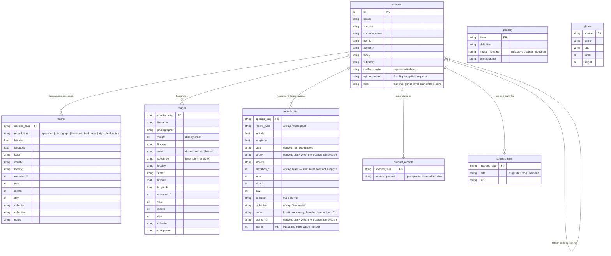

# Data

Source files for the pnwmoths static build pipeline. CSV and JSON files are the authoritative source; Parquet files are derived at build time.

## Entity Relationship Diagram

```mermaid
erDiagram
    species {
        int     id            PK
        string  genus
        string  species
        string  common_name
        string  noc_id
        string  authority
        string  family
        string  subfamily
        string  similar_species   "pipe-delimited slugs"
        string  epithet_quoted    "1 = display epithet in quotes"
        string  tribe             "optional; genus-level, blank where none"
    }

    records {
        string  species_slug   FK
        string  record_type    "specimen | photograph | literature | field notes | sight_field_notes"
        float   latitude
        float   longitude
        string  state
        string  county
        string  locality
        int     elevation_ft
        int     year
        int     month
        int     day
        string  collector
        string  collection
        string  notes
    }

    images {
        string  species_slug   FK
        string  filename
        string  photographer
        int     weight         "display order"
        string  license
        string  view           "dorsal | ventral | lateral | ..."
        string  specimen       "letter identifier (A–H)"
        string  locality
        string  state
        float   latitude
        float   longitude
        int     elevation_ft
        int     year
        int     month
        int     day
        string  collector
        string  subspecies
    }

    glossary {
        string  term           PK
        string  definition
        string  image_filename "illustrative diagram (optional)"
        string  photographer
    }

    plates {
        string  number         PK
        string  family
        string  slug
        int     width
        int     height
    }

    records_inat {
        string  species_slug   FK
        string  record_type    "always 'photograph'"
        float   latitude
        float   longitude
        string  state          "derived from coordinates"
        string  county         "derived; blank when the location is imprecise"
        string  locality
        int     elevation_ft   "always blank — iNaturalist does not supply it"
        int     year
        int     month
        int     day
        string  collector      "the observer"
        string  collection     "always 'iNaturalist'"
        string  notes          "location accuracy, then the observation URL"
        string  district_id    "derived; blank when the location is imprecise"
        int     inat_id        PK "iNaturalist observation number"
    }

    parquet_records {
        string  species_slug   FK
        string  records_parquet "per-species materialized view"
    }

    species_links {
        string  species_slug   FK
        string  site           "bugguide | mpg | bamona"
        string  url
    }

    species ||--o{ records          : "has occurrence records"
    species ||--o{ records_inat     : "has imported observations"
    species ||--o{ images           : "has photos"
    species ||--o{ parquet_records  : "materialized as"
    species ||--o{ species_links    : "has external links"
    species }o--o{ species          : "similar_species (self-ref)"
```

## Files

| File | Rows (approx) | Description |
|------|--------------|-------------|
| `species.csv` | ~900 | One row per species. Primary key is `id`; slug is derived as `genus.lower()-species.lower()`. `epithet_quoted` (`1` or blank) marks epithets the reference site shows in quotes (e.g. Clostera `"apicalis"`); it drives display only — the slug and foreign keys always use the clean epithet. See [`src/_lib/format-epithet.ts`](../src/_lib/format-epithet.ts). |
| `records.csv` | ~30 000 | Geo-referenced occurrence records (specimens, literature, observations). |
| `records-inat.csv` | ~60 | **Generated, not hand-edited.** Occurrence records imported from the [PNWMoths iNaturalist project](https://www.inaturalist.org/projects/pnwmoths) by [`scripts/sync-inat-records.ts`](../scripts/sync-inat-records.ts) (`npm run inat:sync`), rewritten in full every run. Same 15 columns as `records.csv` plus `inat_id`, the observation number that keys the reconcile. See [ADR 0026](../docs/adr/0026-inaturalist-project-sync.md) and [_instructions/SYNCING_INATURALIST.md](../_instructions/SYNCING_INATURALIST.md). |
| `inat-sync-report.csv` | varies | Generated. One row per observation the sync did *not* import, with the reason. Rewritten every run. |
| `records-bad.csv` | varies | Records that failed validation — same schema as `records.csv`. |
| `records-bad-coords.csv` | varies | Records dropped for coordinates outside the PNW bounds (lat 42–60, lon −139 to −110) — typically swapped lat/lon. Kept for curation; not built into the site. Produced by [`scripts/recover-clipped-bc-records.ts`](../scripts/recover-clipped-bc-records.ts). |
| `images.csv` | ~5 000 | Photo metadata. Images are hosted on the CDN; `filename` is the CDN asset key. |
| `image-derivatives.csv` | ~23 000 | Generated, not hand-edited. One row per pre-generated image variant *confirmed uploaded* to the CDN under `derived/` — written by [`scripts/upload-derivatives.ts`](../scripts/upload-derivatives.ts), checked by [`scripts/check-derivatives.ts`](../scripts/check-derivatives.ts) on every build. See [ADR 0022](../docs/adr/0022-pregenerated-image-derivatives.md) and [_instructions/GENERATING_DERIVATIVES.md](../_instructions/GENERATING_DERIVATIVES.md). |
| `glossary.csv` | ~150 | Wing-anatomy and taxonomy terms injected into species fact sheets at build time. |
| `species-links.csv` | ~2 400 | Per-species external links (BugGuide, Moth Photographers Group, Butterflies and Moths of North America). Long format: one row per link (`species_slug,site,url`); a species may have several. Extracted from the legacy reference MySQL DB by [`scripts/extract-reference-links.ts`](../scripts/extract-reference-links.ts) (`npm run links:materialize`). |
| `plates.json` | ~50 | Reference plate metadata (legacy moth-guide plates). Width/height used for CDN image sizing. |
| `parquet/<slug>/records.parquet` | varies | Per-species records, materialized by `scripts/build-data.js` for fast DuckDB queries at build time. |

## Taxonomy provenance (`family` / `subfamily` / `tribe`)

There is **no structured taxonomy table** in the legacy reference site. `family`, `subfamily`, and `tribe` are reverse-engineered from the reference site's CMS browse-page URL hierarchy (`browse/family-…/subfamily-…/[tribe-…/]genus/species`), captured when `species.csv` was first migrated. `subfamily` and `tribe` are both **genus-level** properties — every species of a genus shares them — so they can be backfilled for a blank row by looking up any already-classified species of the same genus.

`tribe` is optional (blank where the subfamily has no tribal subdivision, or the genus post-dates the legacy hierarchy) and was materialized by [`scripts/backfill-tribe.ts`](../scripts/backfill-tribe.ts) from the reference DB's browse paths — additive-only and idempotent. See [ADR 0016](../docs/adr/0016-tribe-hierarchy-level.md) and [data-provenance](../docs/reference/data-provenance.md).

Two things trip up anyone re-deriving this data:

- **The browse URLs use several schemes.** Besides the canonical form above, some subfamily segments drop the `subfamily-` prefix, and the whole **Geometridae** subtree uses an older prefix-less layout (`browse/geometridae/subfamily/tribe/genus/…`). A parser that only handles the canonical form silently drops those species — this is why every Geometridae was unclassified until the backfill in [#74](https://github.com/pnwinsects/pnwmoths/pull/74). Parse the genus out of the path text; do **not** trust the DB's `factsheet_id` join for this (it is misaligned in the current snapshot).
- **Genus synonymy.** A few genera are listed under an older name (e.g. `Speranza` species appear under `Macaria`), so a genus-keyed lookup misses them.

A handful of species remain unclassified because they have no page on the reference site (or their `family` itself is suspect) — tracked in [#73](https://github.com/pnwinsects/pnwmoths/issues/73). Prefer the reference site over external sources like iNaturalist, whose subfamily circumscriptions sometimes disagree (e.g. iNat lumps `Acopa` into Noctuinae; the reference site places it in Amphipyrinae).

## Two record files, two owners

Occurrence records live in two files. `records.csv` is **curator-owned**: hand-edited, and
mutated only by deliberate, maintainer-run scripts. Those are additive with two deliberate
exceptions, both pure deletions a human asks for and reviews as a diff —
[`dedup-records.ts`](../scripts/dedup-records.ts) (purging duplicate rows) and
[`migrate-inat-records.ts`](../scripts/migrate-inat-records.ts) (handing a record to the
iNaturalist sync). Nothing writes it as a side effect of fetching from a network.
`records-inat.csv` is **machine-owned**: rewritten wholesale from the iNaturalist project on
every sync, so a row survives only while its observation is in the project at research grade.

The split exists because reconciliation is destructive — an observation removed from the project
must disappear from the site — and a network-driven row *deleter* must not be pointed at the
curator's file ([ADR 0026](../docs/adr/0026-inaturalist-project-sync.md)).

"Every record the site serves" is the union of the two, defined once in
[`scripts/lib/records-source.ts`](../scripts/lib/records-source.ts). Build steps that feed the
site go through it. Maintainer curation scripts (`dedup-records`, `fill-district-from-coords`,
`backfill-legacy-county`, `recover-clipped-bc-records`) deliberately do not — they mutate the
curator file and must see exactly that file. So do `derive-district-audit.ts` and
`emit-records-district-audit.ts`, whose artifact is keyed by row index into `records.csv` and
whose question ("does the curator's stated county agree with the coordinates?") is meaningless
for imported rows, whose county *is* derived from those coordinates.

## Slug convention

Species slugs are derived as `genus.toLowerCase() + '-' + species.toLowerCase()` (e.g., `apantesis-arizoniensis`). Slugs are used as foreign keys in `records.csv`, `images.csv`, and `parquet/` directory names. They are not stored in `species.csv` — derive them at read time.
