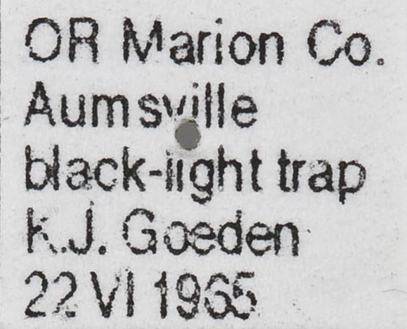
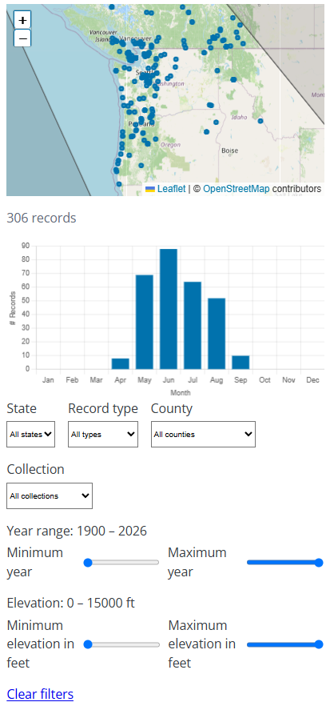
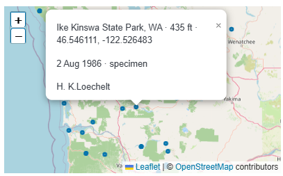

# About the Data

## Data Sources

This website is a data-driven site, with collection and photograph data used to
populate the distribution maps and phenology (seasonality) graphs that appear on
the species account pages. The primary area of coverage for this site includes
Washington, Oregon, Idaho, western Montana, and the southern third of British
Columbia (south of 52ºN latitude). However, for species occurring within this
geographic area, we also provide data for areas surrounding these limits,
including northern British Columbia, western Alberta, central Montana, western
Wyoming, northern Utah, northern Nevada, and northern California.

To date, we have accumulated more than 65,000 data points, drawn from many
institutional and private collections. Most of the databasing was performed by
Jon Shepard, who has been collecting specimen data from museum collections for
over two decades. A list of the collections for which we have data, as well as
the people providing the data, can be found on the
[site credits page](/about/credits/). We are always interested in adding data to
the site — please [contact us](/contact/) if you have data that you would like
to share!

## Locality Interpretation and Georeferencing

In most cases, the data associated with a given datapoint is not a verbatim copy
of the original label data. For example, as much as possible, **we tried to
standardize locality names by beginning each with a recognized geographic
name**. Thus, "2 miles East of Corvallis", "2 mi. E Corvallis", and "Corvallis,
2 miles east" were all entered as "Corvallis, 2mE". This standardizing of the
label information was done, amongst other reasons, to make it less time
consuming to add latitude/longitude coordinates. In addition, standard
abbreviations were used. Thus Creek, Cr., and Ck. were all given as Cr. If
Creek, Lake, Mount, etc. were part of a town name, they were not abbreviated.

**Only modern specimens had latitude and longitude on the labels**, including
material at the M.T. James Collection (WSU) that was collected by Richard Zack
since 1995, W.F. Barr Museum (UI) material collected in the Snake River Canyon
by Frank Merickel, material in the Jon H. Shepard collection that was collected
since 1997, and most material in the Lars G. Crabo collection. In addition,
several sites that had been collected before the era of using latitude/longitude
coordinates on specimen labels were revisited more recently, and thus, historical
data from these sites had latitude/longitude coordinates available from the more
recent collections.

The Oregon State Arthropod Collection had a significant number of specimens with
**Township, Range, and Section**, as did a smaller number of specimens from
other collections. These were converted to latitude/longitude, using the
[Earth Point website](https://www.earthpoint.us/Townships.aspx), using the
centroid latitude/longitude for the Section or Township/Range. Sometimes, only
Township, Range, and Section were provided on labels, with no locality name. In
such cases, that was used as the locality name in our database.

The majority of the specimens we databased for this project had neither
latitude/longitude nor Township, Range, and Section information on their labels,
such as this label:

The principal sources to obtain coordinates for these records were official
Government websites (the
[USGS GNIS Domestic Names Search](https://edits.nationalmap.gov/apps/gaz-domestic/public/search/names)
and the
[Geographical Names Board of Canada place names search](https://geonames.nrcan.gc.ca/search-place-names/search)).
For localities such as Corvallis, Moscow, Portland, Pullman, Seattle, Vancouver,
or Victoria and any label that was within 3 miles of these towns, the **official
latitude/longitude of the town was used**. Most of these data were for older
material, and the city/town boundaries have greatly expanded since the voucher
specimens were collected. For other towns, Shepard was familiar with the
historic boundaries of those towns. Distance from the town was calculated from
the original boundaries. Dayton, Wash. data of Robert Miller is an example of
such data. Shepard had visited and collected with several of the pre-1970's
collectors, and was familiar with their collecting sites. In cases in which
Shepard was unfamiliar with a historical site, Jonathan Pelham was able to supply
much useful information.

When the locality was a small stream, the latitude/longitude for the mouth of
the stream was given. If the specimens were collected three or more miles from a
specific geographic locality, the latitude/longitude was calculated using USA and
CAN topographic maps or the DeLorme State Atlases.

## Manipulating the Data

The species accounts on this site are designed to enable users of the site to
manipulate the data for each species. We have established several data filters,
so that you can view subsets of the data in a variety of different ways.
Applying these data filters will show you the data points on the map that match
the criteria you have used for filtering the data, as well as the phenological
(seasonal) distribution of those specific data points.

The available filters include:

1. The **State** and **County** filters let you see the data from a particular
   geographic area.
2. The **Collection** filter allows you to see the data from a specific moth
   collection.
3. The **Record Type** filter allows you to show only those data points that are
   based on collection specimens, literature references, or observation records.
4. Use the **Year** and **Elevation** range sliders to view the collection
   records for a specific range of dates or elevations. These filters are useful
   for examining whether species have had recent changes in their distribution,
   or to see the effect of elevation on seasonality.

To view the **data for a particular record**, simply click on a dot on
the map. That will open an information popup in which you can view information
about the site where the specimen was found, the date of collection, the
collector, and the collection in which the specimen can be found, along with any
notes accompanying that specimen.

**If you are interested in accessing a large amount of data**, please contact
the collection manager and/or curator of the collection for which you would like
data. Although these collections gave us permission to use their data to populate
our distribution maps, we are not free to distribute large data files of specific
collection records in spreadsheet format.

## Data Quality and Limitations

- Records outside the PNW coordinate bounds (approximately 42–60° N latitude,
  110–139° W longitude) are excluded — often caused by swapped lat/lon values.
- Records missing a valid species identification, coordinates, or state/province
  are excluded from the site.
- Some families (currently Geometridae) have their occurrence records withheld
  while editorial review is in progress.
- Geographic coverage is uneven — areas near research institutions tend to be
  better-represented.
- Coordinate precision varies: some points are exact trap sites, others represent
  the center of a town.

## How Visualizations Are Derived

- **Distribution maps** plot each record's georeferenced coordinates directly on
  the map — no spatial aggregation or smoothing is applied.
- **Phenology charts** show the count of records per calendar month across all
  years combined, illustrating when adults are most frequently encountered.
