# About the Images

## Image Copyright

We have decided to update the copyright status of the images on this site to a
Creative Commons license,
[CC BY-NC-SA](https://creativecommons.org/licenses/by-nc-sa/4.0/). This license
allows people to copy and redistribute the images in any medium or format, as
well as to adapt the images, provided that 1) appropriate attribution is given
along with a link to the license and indication of whether the images were
modified, 2) the images are only used for non-commercial purposes, and 3) any
sharing of the images or derivatives of those images must be distributed under
the same CC BY-NC-SA license. We have not changed the metadata associated with
each of the thousands of images on this site because of the labor involved, and
this statement is intended to supersede any previous copyright status of the
images. We encourage you to save a screenshot of this statement as documentation
of the new copyright status, should you want to use any of our images.

## Individual Moth Photographs

Virtually all of the images that appear in the species accounts and
photographic plates on this website were taken using the
[Visionary Digital BK Plus Imaging System](https://www.visionarydigital.com/IntegratedSystems1.html),
illustrated below:

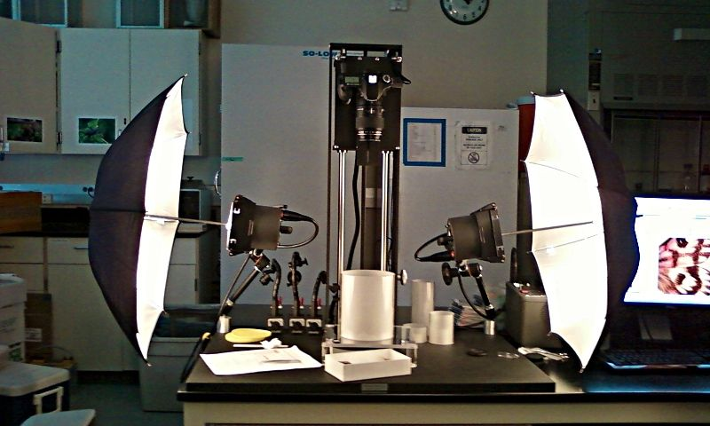

This state-of-the-art system couples a high-resolution digital SLR camera
(Canon 40D) that features a suite of lenses for different degrees of
magnification (we used a 100mm macro lens for all but the largest specimens),
powerful studio flash lighting to allow small apertures (and thus adequate depth
of field), and a computer-driven camera lift operated by a high-end image
processing computer. A set of reflectors and diffusors make it possible to
obtain lighting that is both bright and soft — a challenge for macrophotography
in general. We have found it difficult to obtain similar results using other
setups, largely due to limitations in lighting, resulting in poor depth of field
and/or blurriness from vibrations that occur with slow shutter speeds.

## Viewing the Images in High Resolution

The moth images on this site can be viewed in high resolution on the individual
species account pages. For example, here is what you will see at the page for
[*Apantesis ornata*](/species/apantesis-ornata/):

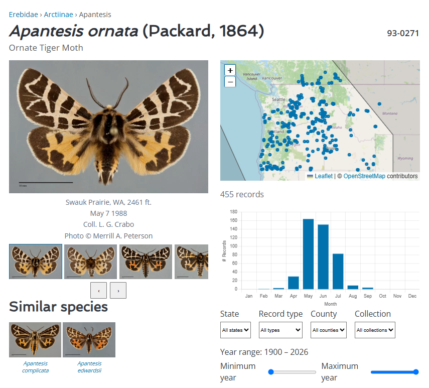

The large image is one of a series of images of this species. **To see other
images of the featured species in large format**, use the arrow to the right of
the small thumbnail images below the large image, and click on the image you
wish to see. Note that clicking the images under Similar Species will cause a
new window to open, featuring the Species Account for that similar species.

For species with high-resolution imagery available, **clicking the main image
opens an interactive deep-zoom viewer** (shown below for
[*Coloradia doris*](/species/coloradia-doris/)). The toolbar in the upper-left
provides pan, zoom-out, home (reset), and full-screen controls:

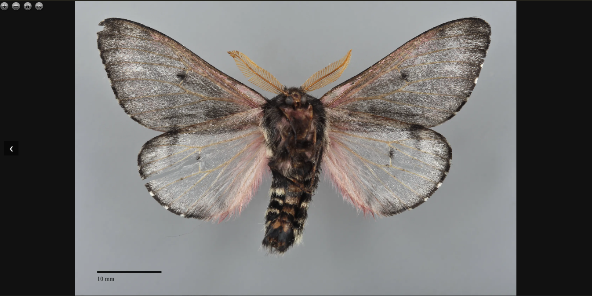

You can pan by dragging the image, zoom with the scroll wheel or toolbar
buttons, and enter **full-screen mode** using the rightmost toolbar button to
see the image at maximum size with the ability to zoom in further — revealing
incredible detail in wing scales and body structures.

## A Guide to Making Photographic Plates

*The methods we use for producing photographic plates are adapted from methods
developed by Jocelyn Gill, of the Canadian National Collection. Special thanks
to Jocelyn for sharing her tried and true photo-manipulating tricks! This
description is written for users of Adobe Photoshop version CS3, but the
functions described below also exist in the newest version of Photoshop. To use
this guide, you will need a basic understanding of the use of Photoshop. Note
that advanced users may streamline many of the tasks described below by using
Photoshop macro commands.*

### Setting up the Plate Template

The first step is to set up a blank plate template to use for all plates. Always
keep a copy of this template, so you can easily start up a new blank plate when
you have filled the one on which you are currently working.

1. First, decide on the size of the plate you want to make. This may depend on
   the size of paper you might be using for printing/publishing. For example, we
   created 8″ × 10″ plates, so that they could be printed on 8½″ × 11″ paper.

   In Photoshop, create a new document by selecting File, and selecting New in
   the scroll-down menu. Then name the file and change the size to 8″ width by
   10″ length (or other dimensions, if you prefer).

   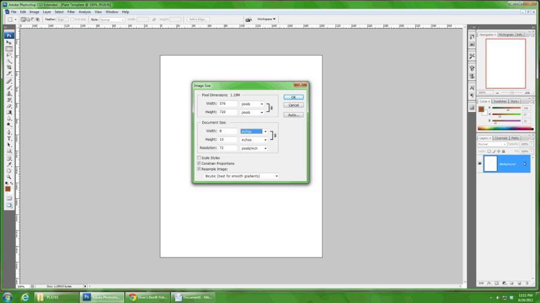

2. Next, choose a background color for the plate. We used light grey, to allow
   the colors of the moths to be easily seen, without having the background
   color be too distracting.

   From the main menu panel on the left, choose the paint bucket tool, which is
   the 12th icon down on the tool panel on the left (or you can open it with the
   default keyboard shortcut, by pressing the letter G). This icon position is
   shared with the gradient tool, so if the paint bucket is not selected, right
   click the icon and change it to the paint bucket tool.

   Next, choose the background color for the plate. To do so, you can change the
   RGB values manually by sliding the arrows in the color menu, or you can
   simply click the color box, and this will bring up the color palette from
   which you can select a color. For the grey background of our plates, we used
   values R=209, G=210, and B=211. After selecting a color or specifying the RGB
   values, click the background and it will fill with the color that you have
   chosen.

   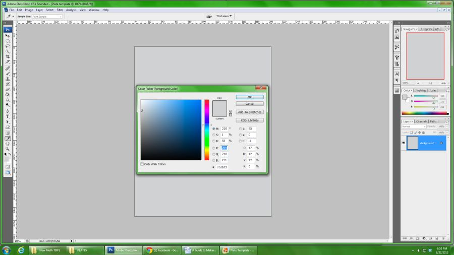

3. A scale bar is necessary to indicate the scale of the specimens illustrated
   on the plates, relative to life size. We scaled the plates so that all moths
   would be life size when the plates were viewed in an 8″ × 10″ format, but we
   also added a 10 mm scale bar to each plate, so viewers could determine how
   much larger or smaller than life size they were viewing a particular plate (if
   it were viewed at a size other than 8″ × 10″).

   1. To produce a 1 cm scale bar, first change the units of the main ruler in
      Photoshop (the one seen at the top of the screen) to mm. To do this, go to
      Edit > Preferences > Units and Rulers and change this to mm.
   2. Next, click the shapes tool (keyboard shortcut U, or the 18th icon down on
      the tool panel on the left), and click the line tool. Choose different
      shapes by right clicking (control-click for Mac users) the shapes icon.
      Choose or change the color of the line in the same way you chose a color
      for the background. We used black.
   3. Change the thickness of the line by changing the value in the "weight" box
      at the top of the screen when the line tool is selected. We used 1 mm.
   4. Once you have selected the color and weight of your scale bar, use the line
      tool to draw a line to the length you want by lining up the line with the
      ruler on the top of the screen.

      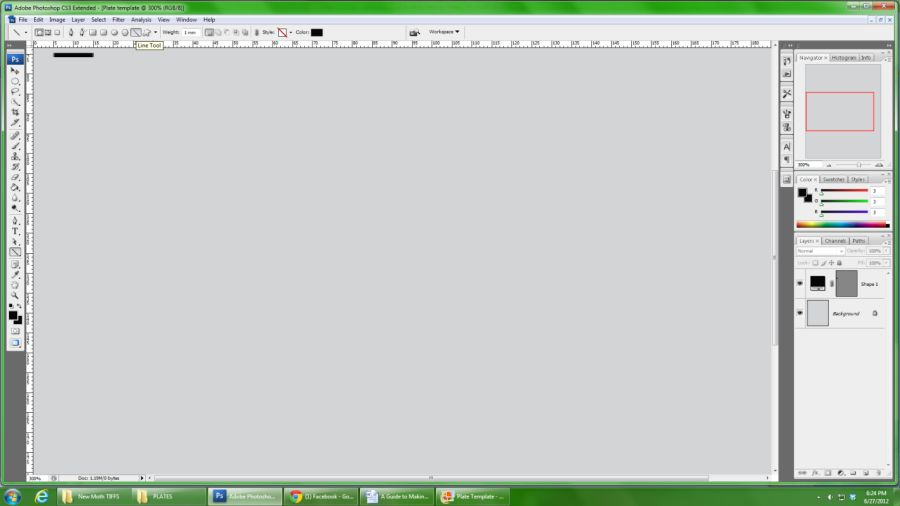

   5. Next drag the line to the bottom left corner (or wherever you want the
      scale bar to appear), and with a textbox (keyboard shortcut T) type text
      (e.g., 10 mm) to indicate the length of the scale bar you created.

4. To add a title, subtitles, and a footer for your plate, use a font/size that
   appeals to you, and that will be legible when printed. We used the following
   for our plates:

   - Title = Arial Bold, 12 pt font
   - Subtitle = Arial Bold, 11 pt font
   - Footer = Arial Regular, 6 pt font

   

### Editing Moth Images

The next step is to edit individual moth images (.tif format) to add to the
plates.

5. First you will need to crop the image of the moth, so that the image contains
   the moth and the scale bar from the original .tif image, but no background
   color (that way, none of the original background will show when the image is
   transferred to the plate).

   1. First, make a copy of the individual moth .tif image (to avoid making any
      changes to the original file). Open the new copy and right click
      (control-click for Mac users) the layers panel and select in the drop down
      menu "merge visible". This will merge ALL of your layers together into ONE
      layer, so that the scale bar and the moth are now considered one image.
      This will make things easier for the next step.
   2. Next, select the magic wand tool (keyboard shortcut W, or the fourth icon
      down on the main tools panel on the left). This is shared with the quick
      selection tool, so you may need to right click (control-click for Mac
      users) and change it to the magic wand tool. The magic wand tool is used to
      select certain portions of an image, and one can change the sensitivity of
      what is selected by changing the tolerance. We used a tolerance of 20.
   3. Once you have selected the magic wand tool, click anywhere in the
      background of the image of the moth. After you have done this, most or all
      of the moth and the scale bar should be outlined with a flashing dashed
      line. To add major areas that were left out (e.g., if a substantial part of
      the moth is not included within the area surrounded by the dashed line),
      hold control and click those omitted areas that you would like to include.

      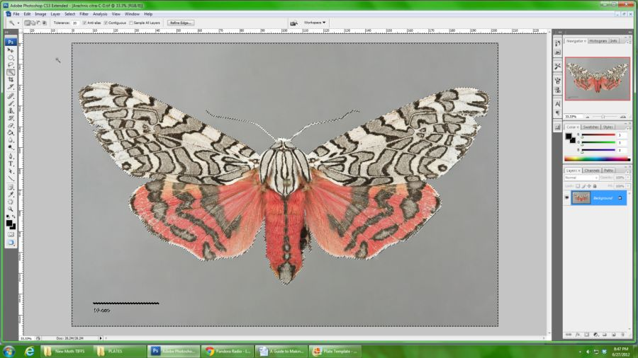

   4. The dashed outline indicates what will be cropped, and we ultimately want
      to crop the entire moth and the scale bar. Sometimes there are small
      crevices between the legs or areas between plumose antennae that can't be
      picked up by the magic wand tool very well. The easiest way to highlight
      these places is to manually select them with the Quick Mask Tool (keyboard
      shortcut Q, or the second to last icon on the tool panel on the left).
   5. Notice that what you have selected with the magic wand tool has now turned
      red. The red area indicates what will be left after you crop the image.
      Here, you can zoom in and find small areas that you either want to include
      in the crop, or want to remove from the crop.

      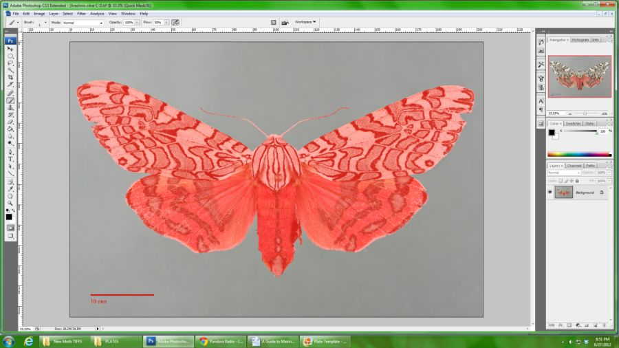

   6. To add something to the cropped image, select the Brush Tool (keyboard
      shortcut B, or the 8th icon on the tool panel on the left). You can change
      the size of the brush tool by adjusting the menu on the top left of the
      screen to the size you would like. To select areas to add to the cropped
      image, simply draw with the brush over what you want to include. Any areas
      added to the cropped image should turn red as you add them.
   7. To erase something from the cropped image, select the Eraser Tool (keyboard
      shortcut E, or the 11th icon on panel on the left). Again, you can change
      the size of the eraser tool by adjusting the menu on the top left of the
      screen to the size you would like. Simply draw with the eraser over what
      you want to remove from the cropped image. It should turn back to normal
      color if you are "erasing" it from the image to be cropped.

      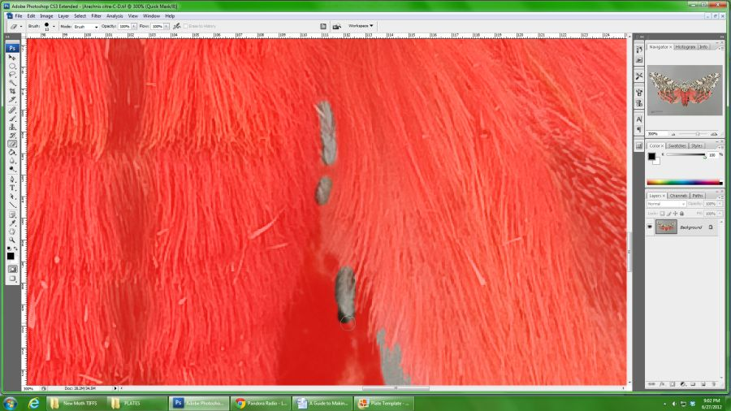

   8. Once you have everything highlighted that you want to include (and nothing
      highlighted that you don't want to include), click the Quick Mask tool
      again and go back to viewing the selection (the red will be gone now, but
      all the things you selected will be outlined with the flashing dashed
      lines).

6. Because the area that was highlighted in red indicates what is going to be
   removed from the final image, we need to reverse this, so that the area that
   was in red will be the portion of the image that remains after cropping. To do
   this reversal, first go to the main menu bar and click Select > Save Selection
   and then name it whatever you would like.

   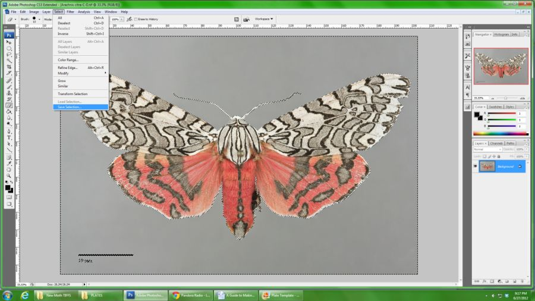

   1. Next, from the main menu click Select > Load Selection and click on the
      name you just created and check the box that says invert. This will invert
      your original selection so that just the moth and the scale bar will be
      left.

      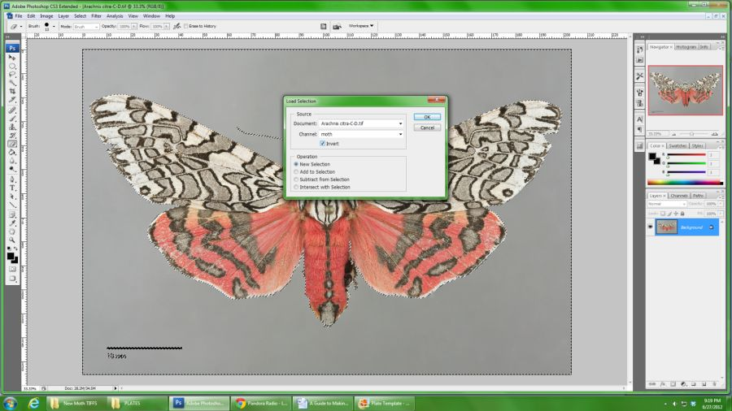

   2. We need to make a new file onto which the new cropped image will be saved.
      Create a new file and name it accordingly. We usually make the dimensions
      of the new file 40 inches by 40 inches, which is enough space for the new
      image to fit without too much resizing (our image originals are large!).
      Once you have made the new file, grab the moth by using the Move Tool
      (keyboard shortcut V) and dragging it over to the new file.

      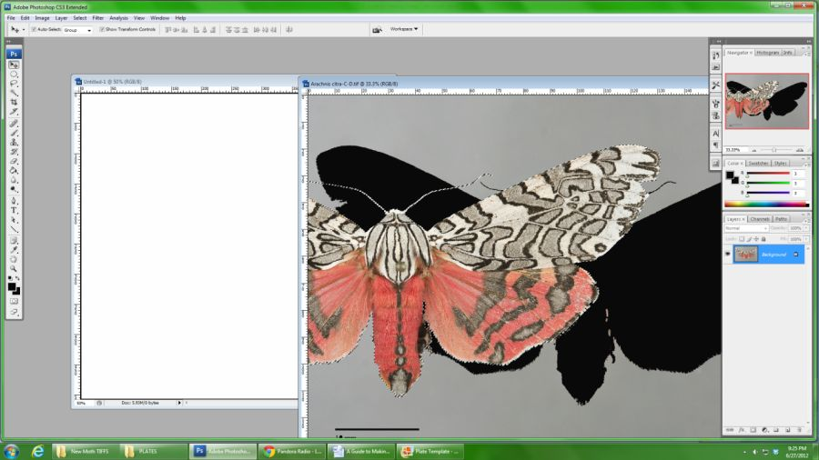

   3. Close the original file without saving. You are now left with your
      perfectly cropped moth image and scale bar without any background.

      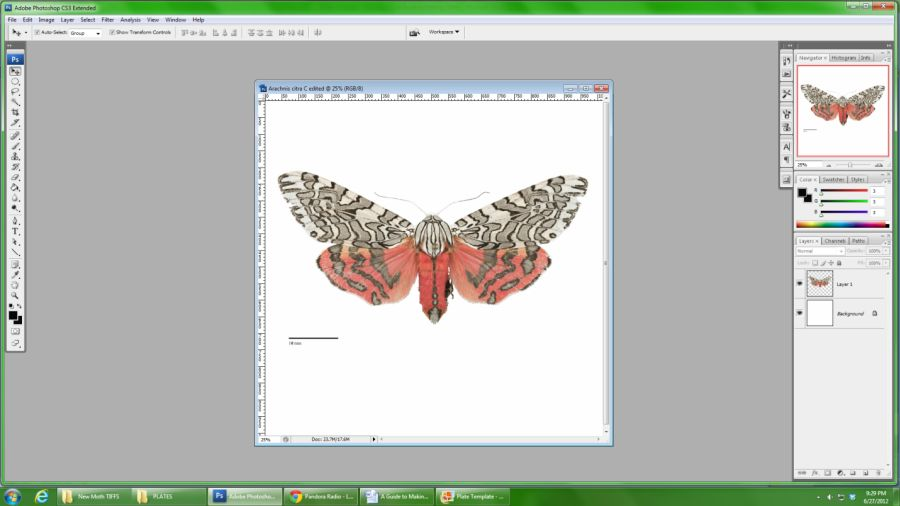

   4. The last thing to do before moving the moth onto the plate is to remove the
      pinhead from the image. To do so, select the Clone Stamp Tool (keyboard
      shortcut S, or the 9th icon on the left side). Select the layer with the
      moth and hold the Alt button while clicking an area near the pin head, and
      then letting go of the Alt button and clicking on the pin head. This will
      replace the pinhead with a copy of what was in the place where you first
      clicked Alt. You can change the size of the brush, the opacity and the flow
      of what is copied and pasted by adjusting the bars on the top left menu of
      the screen when the clone stamp tool is selected. It takes a bit of work
      and artistic creativity to clone areas surrounding the pin head to make it
      look natural, so keep at it!

      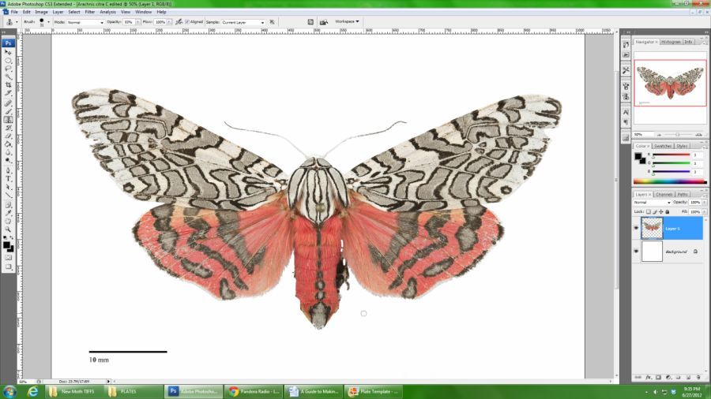
      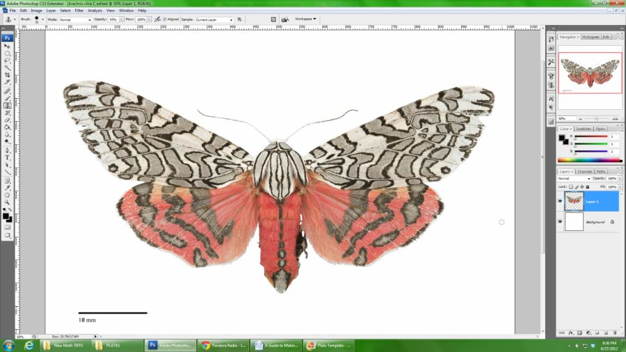

   5. You can also use this method to fix rips, tears, holes and missing antennae
      from the moth image. However, if you are working with images of holotype
      specimens, you CANNOT make these kinds of changes, as images of holotypes
      must not be retouched.

### Transferring Moth Images to Plates

What follows are the final steps of creating plates, including transferring the
images, sizing, creating shadows, naming/labels and aligning specimens.

7. Open the plate template and the edited moth image. Grab the moth image using
   the Move Tool (keyboard shortcut V) and drag it onto the plate.

8. Before you do anything else, the moth image needs to be resized according to
   the scale bar (created earlier) on the plate.

   1. Move the moth image to the lower left corner (where the scale bar is), and
      begin to size the image by grabbing corners of the box around the image and
      dragging. Be sure to hold the shift key while you size the image so that
      the proportions stay the same.
   2. The scale bars we added to our original moth images were 10 mm, which is
      why we made the scale bar on the plate 10 mm. Thus, to scale the moth
      correctly for the plate, we just need to make the scale bar on the moth
      image match the size of the scale bar on the plate.
   3. Once this is done, your moth is now the correct size, and you can remove
      the scale bar from the moth image by selecting the eraser tool (keyboard
      shortcut E) and erasing it.

   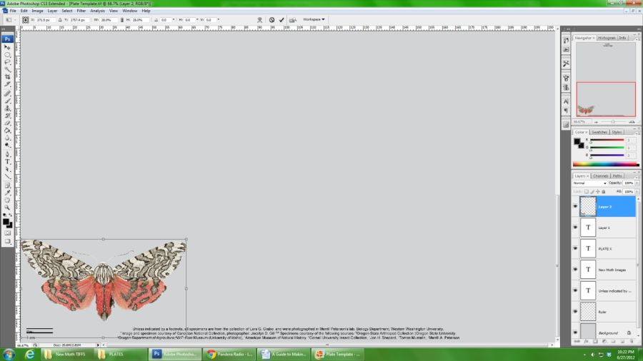

9. Next, add a shadow to the moth.

   1. From the top drop down menu select Layer > Layer Style > Drop Shadow
   2. From this menu you can adjust the opacity of the shadow, the color, the
      distance, size and spread of the shadow, as well as the angle from which
      the lighting is coming (the standard for scientific illustrations is for
      the light to be coming from the top left, casting a shadow to the lower
      right). Play around with the shadow options until you get the look you
      want. For our plates, we used:
      - Color = Dark Grey
      - Angle = 120°
      - Distance = 70 px
      - Spread = 0%
      - Size = 85 px

      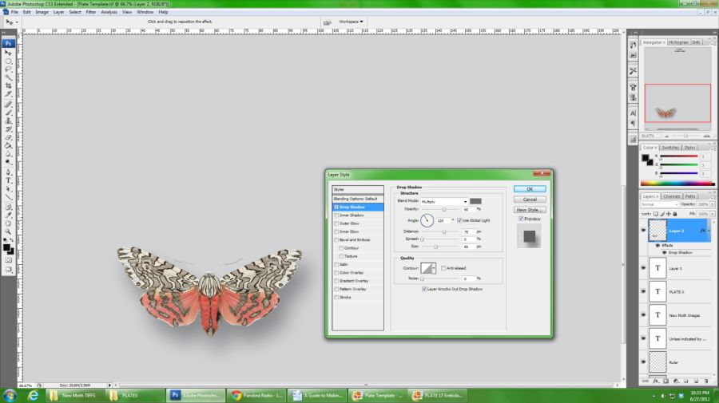

   3. If you have many moth images on one plate, you can right click
      (control-click for Mac users) the moth image that has the shadow you like,
      and from the menu select Copy Layer Style and then paste this layer style
      onto other moths on the plate (so that you don't have to manually create
      the shadow for every moth).

### Creating Names and Lining up Specimens

The last steps are to create name labels for your moth images, and to line up
and organize the images.

10. To create a name label, click the Type Tool (keyboard shortcut T) and type
    the name of the specimen. We used Arial Bold Italic 8 pt font for our
    plates.

11. One of the hardest parts of making the plates is lining up specimens and name
    labels, and getting things to look the way you want them to. This takes a bit
    of moving and adjusting, and can be made easier by using grid lines (from the
    main menu select View > Show > Grid, or keyboard shortcut Ctrl+') as a guide
    to line up specimens. For our plates, we lined up the trailing margin of the
    forewing of all moth specimens in the same row.

12. Another option is to create your own lines (the same way the scale bar was
    created earlier) that span the length of the plate, and line up the name
    labels and moths using those as guides.

    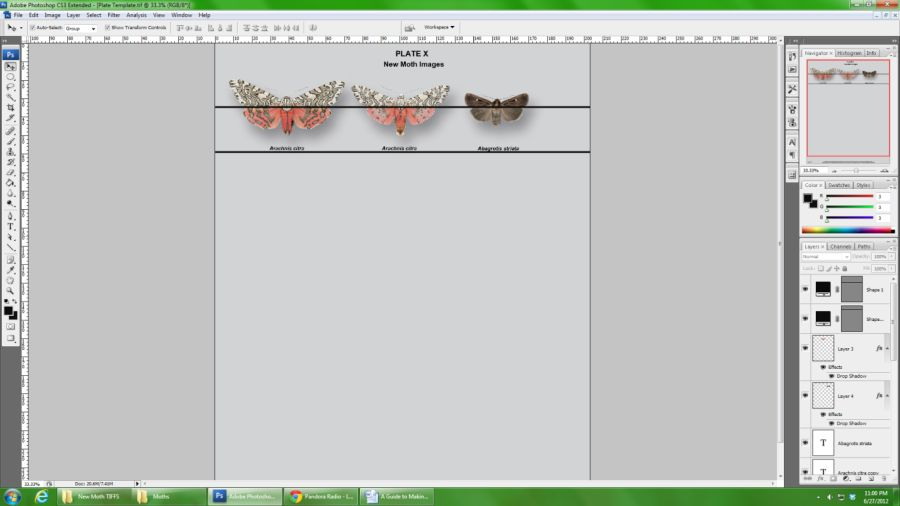

13. Congratulations — you have finished building a photographic plate!

### Image of a Finished Plate

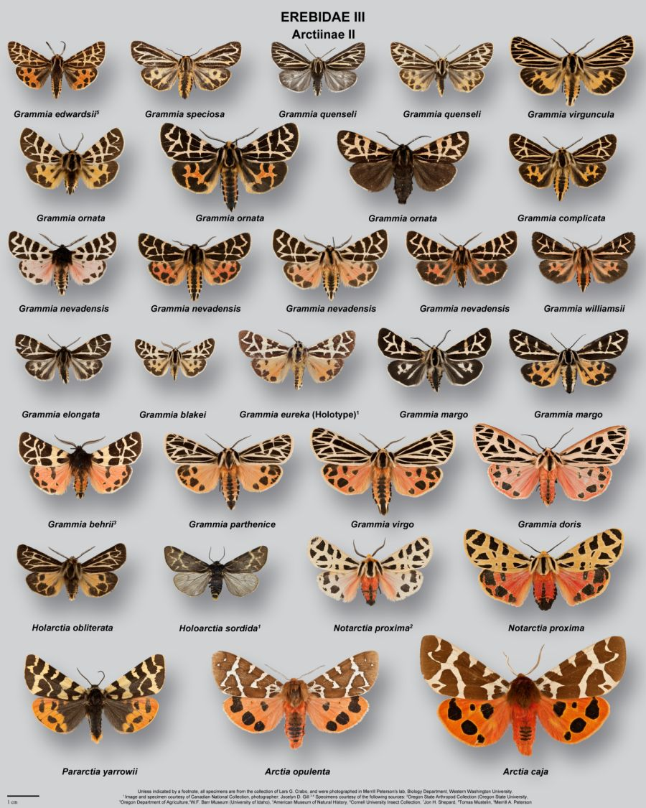
